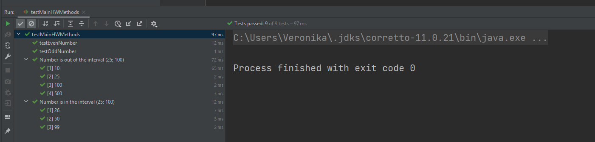
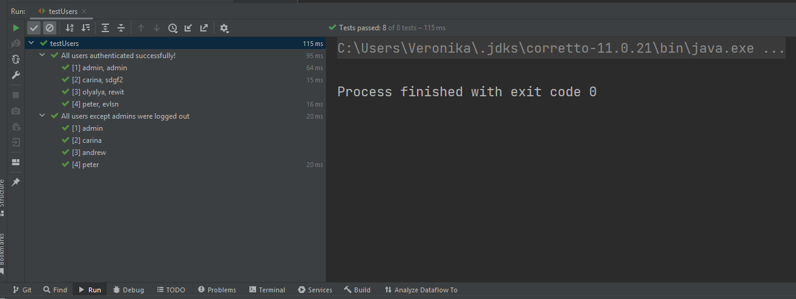

# HOMEWORK 3
*Задание 1.

Напишите тесты, покрывающие на 100% метод [evenOddNumber](src/hw/MainHW.java), 
который проверяет, является ли переданное число четным или нечетным. 
(код приложен в презентации)

Задание 2.

Разработайте и протестируйте метод [numberInInterval](src/hw/MainHW.java), 
который проверяет, попадает ли переданное число в интервал (25;100). 
(код приложен в презентации)

[testfile](test/testMainHWMethods.java)

Результаты заданий 1 и 2

Задание 3.  (необязательное)

Добавьте функцию в класс [UserRepository](src/tdd/UserRepository.java), которая разлогинивает всех пользователей, 
кроме администраторов. Для этого, вам потребуется расширить класс [User](src/tdd/User.java) новым свойством, 
указывающим, обладает ли пользователь админскими правами. Протестируйте данную функцию.

[solution](test/testUsers.java)

Результат заданий 3

