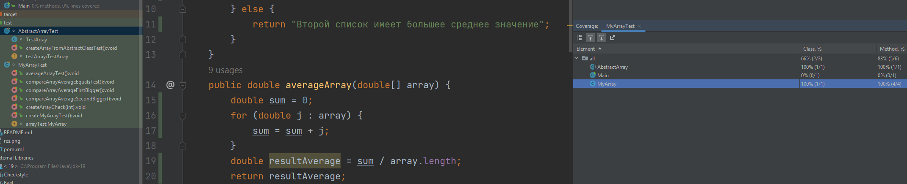

# HOMEWORK 6
**Задание 1. Создайте программу на Python или Java, которая принимает два списка чисел и выполняет следующие действия:**

a. Рассчитывает среднее значение каждого списка.

b. Сравнивает эти средние значения и выводит соответствующее сообщение:
- ""Первый список имеет большее среднее значение"", если среднее значение первого списка больше.
- ""Второй список имеет большее среднее значение"", если среднее значение второго списка больше.
- ""Средние значения равны"", если средние значения списков равны.

**Важно:**

Приложение должно быть написано в соответствии с принципами объектно-ориентированного программирования.
- Используйте Pytest (для Python) или JUnit (для Java) для написания тестов, 
которые проверяют правильность работы программы. Тесты должны учитывать различные сценарии использования вашего приложения.
- Используйте pylint (для Python) или Checkstyle (для Java) для проверки качества кода.
- Сгенерируйте отчет о покрытии кода тестами. Ваша цель - достичь минимум 90% покрытия.

*Формат и требования к сдаче:*

## Отчет о выполнении этого задания должен включать в себя следующие элементы:
- Код программы [task1](src) классы `AbstractArray` и `MyArray`
- Код тестов [task2](test)
- Отчет pylint/Checkstyle (все красненькое, но я уже не вижу смысла исправлять. замечания понятны)

- Отчет о покрытии тестами (по классам `AbstractArray` и `MyArray` покрытие 100%)

- Объяснение того, какие сценарии покрыты тестами и почему вы выбрали именно эти сценарии.

  Тестами (юнит-тестами) покрыты все функции `MyArray`, поскольку в рамках задачи не очень понятно
  как должно быть реализовано приложение. Конечно, можно было выполнить еще пользовательский 
  инфтерфейс и добавить обработку исключений, соответственно, дополнительно написать интеграционные тесты и сквозной 
  тест на ввод данных от пользователя  и их сравнение, но в рамках задачи "сравни два массива" я не хочу этого делать.  

